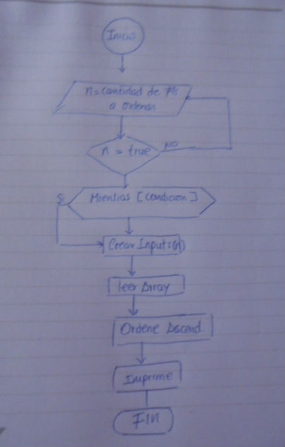

Prueba Técnica

url: https://janetquispeu.github.io/PruebaTecnica/

La Interfaz gráfica consiste, en que un determinado conjunto de número enteros se ordene de manera ascendente, para lo cual, lo que hice primero fue desarrollar mi algoritmo.

Pseudocódigo:

Para este desafío utilicé el framework Bootstrap para tener una plantilla(grillas) y algunos estilos en los botones también use la librería animate css3 que me permitio dar animación al resultado y por último la biblioteca jquery que  me permite simplificar código en javascript.

